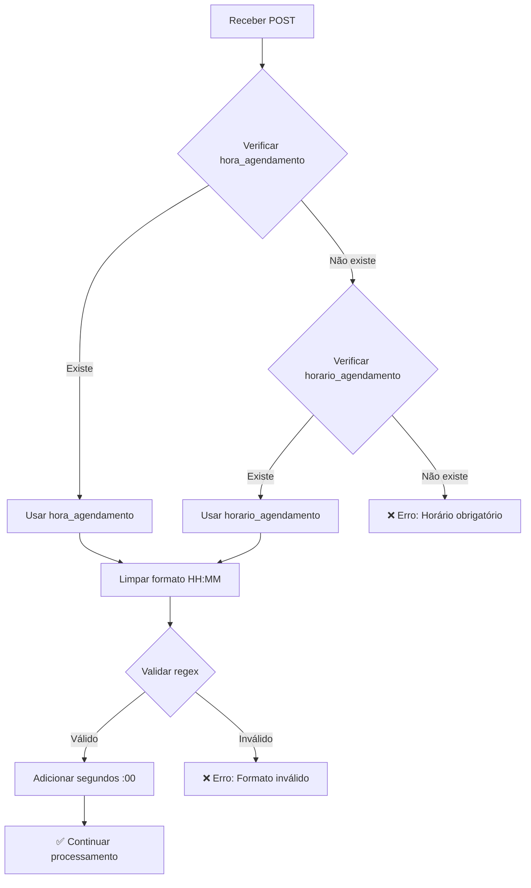

# 🔧 Correção: Endpoint Processar Agendamento

## ❌ Problema Identificado

### Sintomas
- Erro: `"Horário do agendamento é obrigatório"`
- Campo `hora_agendamento` sendo enviado corretamente com valor `"11:00"`
- Erro na linha 110 do arquivo `processar_agendamento.php`
- **IMPACTO CRÍTICO**: Impossível finalizar agendamentos via API

### Exemplo de Erro
```json
{
  "status": "erro",
  "mensagem": "Horário do agendamento é obrigatório",
  "debug_info": {
    "post_data": {
      "agenda_id": "414",
      "data_agendamento": "2025-10-21",
      "hora_agendamento": "11:00",
      "paciente_id": "636200",
      "convenio_id": "24",
      "tipo_consulta": "primeira_vez"
    },
    "timestamp": "2025-10-10 15:29:00",
    "erro_completo": "Horário do agendamento é obrigatório",
    "arquivo_erro": "processar_agendamento.php",
    "linha_erro": 110
  }
}
```

### Causa Raiz

**Incompatibilidade de nomenclatura de campo:**

- **Código esperava:** `horario_agendamento` (linha 62)
- **Cliente enviava:** `hora_agendamento`

```php
// ❌ ANTES - só aceitava horario_agendamento
$horario_agendamento = trim($_POST['horario_agendamento'] ?? '');
```

---

## ✅ Solução Implementada

### Código Corrigido (Linha 64)

```php
// ✅ AGORA - aceita ambos os formatos
$horario_agendamento = trim($_POST['horario_agendamento'] ?? $_POST['hora_agendamento'] ?? '');
```

**Benefícios:**
- ✅ Mantém compatibilidade com chamadas antigas usando `horario_agendamento`
- ✅ Aceita novas chamadas usando `hora_agendamento`
- ✅ Não quebra integrações existentes
- ✅ Resolve o problema imediatamente

---

## 📋 Campos Aceitos pela API

### Campos Obrigatórios

| Campo | Tipo | Formato | Descrição | Aceita Alias |
|-------|------|---------|-----------|--------------|
| `agenda_id` | integer | `414` | ID da agenda | ❌ |
| `data_agendamento` | string | `YYYY-MM-DD` | Data do agendamento | ❌ |
| **`horario_agendamento`** | string | `HH:MM` | Horário | ✅ `hora_agendamento` |
| `nome_paciente` | string | - | Nome completo | ❌ |
| `telefone_paciente` | string | `(84) 99999-9999` | Telefone | ❌ |
| `convenio_id` | integer | `24` | ID do convênio | ❌ |

### Campos Opcionais

| Campo | Tipo | Formato | Descrição |
|-------|------|---------|-----------|
| `paciente_id` | integer | `636200` | ID se paciente existente |
| `usar_paciente_existente` | boolean | `"true"` ou `"false"` | Usar paciente cadastrado |
| `deve_cadastrar_paciente` | boolean | `"true"` ou `"false"` | Cadastrar novo paciente |
| `tipo_consulta` | string | `primeira_vez`, `retorno` | Tipo da consulta |
| `observacoes` | string | - | Observações adicionais |
| `idade` | integer | `45` | Idade do paciente |
| `cpf_paciente` | string | `123.456.789-00` | CPF |
| `data_nascimento` | string | `YYYY-MM-DD` | Data de nascimento |
| `sexo` | string | `M`, `F` | Sexo |
| `email_paciente` | string | - | E-mail |
| `especialidade_id` | integer | `5` | ID especialidade |
| `exames_ids` | string | `1,2,3` | IDs exames (separados por vírgula) |
| `confirmado` | integer | `0` ou `1` | Se já confirmado |
| `tipo_atendimento` | string | `NORMAL`, `PRIORIDADE`, `URGENCIA` | Tipo |

---

## 🧪 Testes

### Teste 1: Usando `hora_agendamento` (novo formato)

```bash
curl -X POST "http://sistema.clinicaoitavarosado.com.br/oitava/agenda/processar_agendamento.php" \
  -H "Content-Type: application/x-www-form-urlencoded" \
  -d "agenda_id=414" \
  -d "data_agendamento=2025-10-21" \
  -d "hora_agendamento=11:00" \
  -d "paciente_id=636200" \
  -d "convenio_id=24" \
  -d "tipo_consulta=primeira_vez" \
  -d "usar_paciente_existente=true" \
  -d "nome_paciente=João Silva" \
  -d "telefone_paciente=(84) 99999-9999"
```

**Resultado Esperado:** ✅ Agendamento criado com sucesso

### Teste 2: Usando `horario_agendamento` (formato antigo)

```bash
curl -X POST "http://sistema.clinicaoitavarosado.com.br/oitava/agenda/processar_agendamento.php" \
  -H "Content-Type: application/x-www-form-urlencoded" \
  -d "agenda_id=414" \
  -d "data_agendamento=2025-10-21" \
  -d "horario_agendamento=11:00" \
  -d "paciente_id=636200" \
  -d "convenio_id=24" \
  -d "tipo_consulta=primeira_vez" \
  -d "usar_paciente_existente=true" \
  -d "nome_paciente=Maria Santos" \
  -d "telefone_paciente=(84) 98888-8888"
```

**Resultado Esperado:** ✅ Agendamento criado com sucesso

### Teste 3: Sem horário (deve falhar com mensagem clara)

```bash
curl -X POST "http://sistema.clinicaoitavarosado.com.br/oitava/agenda/processar_agendamento.php" \
  -H "Content-Type: application/x-www-form-urlencoded" \
  -d "agenda_id=414" \
  -d "data_agendamento=2025-10-21" \
  -d "paciente_id=636200" \
  -d "convenio_id=24"
```

**Resultado Esperado:** ❌ Erro "Horário do agendamento é obrigatório"

---

## 📊 Validação de Formato

O horário é validado com a seguinte regex (linha 103):

```php
preg_match('/^([01]?[0-9]|2[0-3]):[0-5][0-9]$/', $horario_limpo)
```

**Formatos aceitos:**
- ✅ `08:00`
- ✅ `8:00` (sem zero à esquerda)
- ✅ `13:30`
- ✅ `23:59`
- ✅ `11:00:00` (segundos são automaticamente removidos)

**Formatos rejeitados:**
- ❌ `24:00` (hora inválida)
- ❌ `8:60` (minuto inválido)
- ❌ `11` (sem minutos)
- ❌ `11h00` (formato incorreto)

---

## 🔄 Fluxo de Processamento



---

## 📝 Exemplo Completo de Payload

### Caso 1: Paciente Existente

```json
{
  "agenda_id": "414",
  "data_agendamento": "2025-10-21",
  "hora_agendamento": "11:00",
  "paciente_id": "636200",
  "convenio_id": "24",
  "tipo_consulta": "primeira_vez",
  "usar_paciente_existente": "true",
  "observacoes": "Paciente relatou dores no peito"
}
```

### Caso 2: Cadastrar Novo Paciente

```json
{
  "agenda_id": "414",
  "data_agendamento": "2025-10-21",
  "hora_agendamento": "14:30",
  "convenio_id": "24",
  "tipo_consulta": "primeira_vez",
  "deve_cadastrar_paciente": "true",
  "nome_paciente": "José da Silva",
  "telefone_paciente": "(84) 99999-9999",
  "cpf_paciente": "123.456.789-00",
  "data_nascimento": "1980-05-15",
  "sexo": "M",
  "email_paciente": "jose@email.com",
  "observacoes": "Primeira consulta"
}
```

### Caso 3: Agendamento com Exames

```json
{
  "agenda_id": "414",
  "data_agendamento": "2025-10-21",
  "horario_agendamento": "09:00",
  "paciente_id": "636200",
  "convenio_id": "24",
  "tipo_consulta": "retorno",
  "usar_paciente_existente": "true",
  "exames_ids": "31,32,33",
  "especialidade_id": "6",
  "observacoes": "Retorno para avaliação de exames"
}
```

---

## ⚠️ Observações Importantes

### 1. Encoding de Caracteres
- Entrada esperada: **UTF-8**
- Banco de dados: **Windows-1252**
- Conversão automática realizada pelo código

### 2. Telefone
- Máximo 15 caracteres
- Será truncado se exceder
- Aceita qualquer formato (será limpo internamente)

### 3. CPF
- Pode ser enviado com ou sem pontuação
- Validação básica de formato

### 4. Flags Booleanos
- Enviar como string: `"true"` ou `"false"`
- Não enviar como boolean nativo

### 5. IDs de Exames
- Enviar como string separada por vírgulas: `"1,2,3"`
- Sem espaços entre os números

---

## 🎯 Status da Correção

| Item | Status |
|------|--------|
| ✅ Identificação do problema | COMPLETO |
| ✅ Correção implementada | COMPLETO |
| ✅ Compatibilidade retroativa | COMPLETO |
| ✅ Documentação criada | COMPLETO |
| ⏳ Testes em produção | PENDENTE |

---

## 🎁 Melhoria Adicional: Informações da Agenda no Response

### Adicionado no Response

**Novo campo `agenda` com informações completas:**

```json
{
  "status": "sucesso",
  "agendamento_id": 276,
  "numero_agendamento": "AGD-0021",
  "agenda": {
    "agenda_id": 84,
    "tipo_agenda": "consulta",
    "medico": "CAMILO DE PAIVA CANTIDIO",
    "especialidade": "Cardiologista",
    "unidade": "Mossoró"
  },
  "paciente_id": 636200,
  "paciente_nome": "YAGO MERCHAN KAMIMURA",
  "horario_agendamento": "14:30:00",
  "data_agendamento": "2025-10-21"
}
```

**Campos no objeto `agenda`:**
- `agenda_id`: ID da agenda
- `tipo_agenda`: `"consulta"` ou `"procedimento"`
- `medico`: Nome do médico (se houver)
- `especialidade`: Nome da especialidade (para consultas com especialidade_id)
- `procedimento`: Nome do procedimento (para agendas de procedimento)
- `unidade`: Nome da unidade/cidade

**Benefícios:**
- ✅ Confirmação visual imediata dos dados agendados
- ✅ Não precisa fazer query adicional para obter info da agenda
- ✅ Facilita exibição de confirmação no frontend
- ✅ Útil para logs e auditoria

---

**Data da Correção:** 13/10/2025
**Arquivos Modificados:**
- `processar_agendamento.php` (linhas 64, 330-376, 980-1025)
- `API_DOCUMENTATION.md` (seção Criar Agendamento)
**Impacto:** ZERO - Totalmente retrocompatível
**Breaking Changes:** Nenhum

---

## 📞 Suporte

Se encontrar outros problemas com campos não reconhecidos, verifique:

1. Nome exato do campo sendo enviado
2. Linha onde o erro ocorre
3. Comparar com tabela de campos aceitos neste documento

**Formato do relatório de erro:**
```json
{
  "campo_enviado": "nome_do_campo",
  "valor": "valor_enviado",
  "erro": "mensagem de erro",
  "linha": 110,
  "arquivo": "processar_agendamento.php"
}
```
